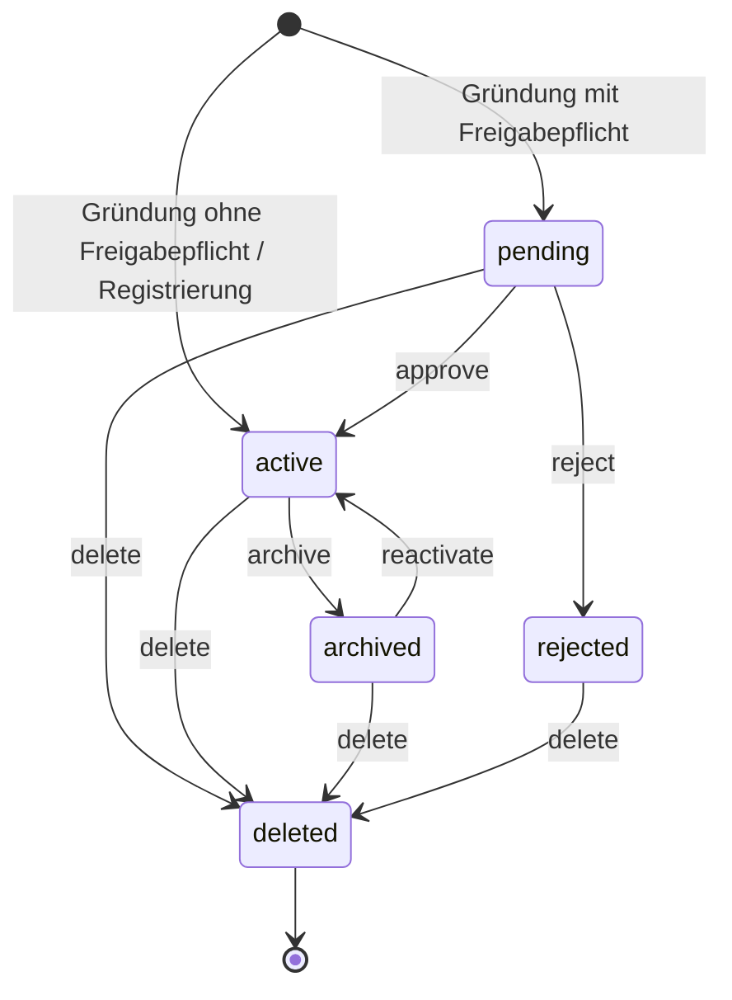
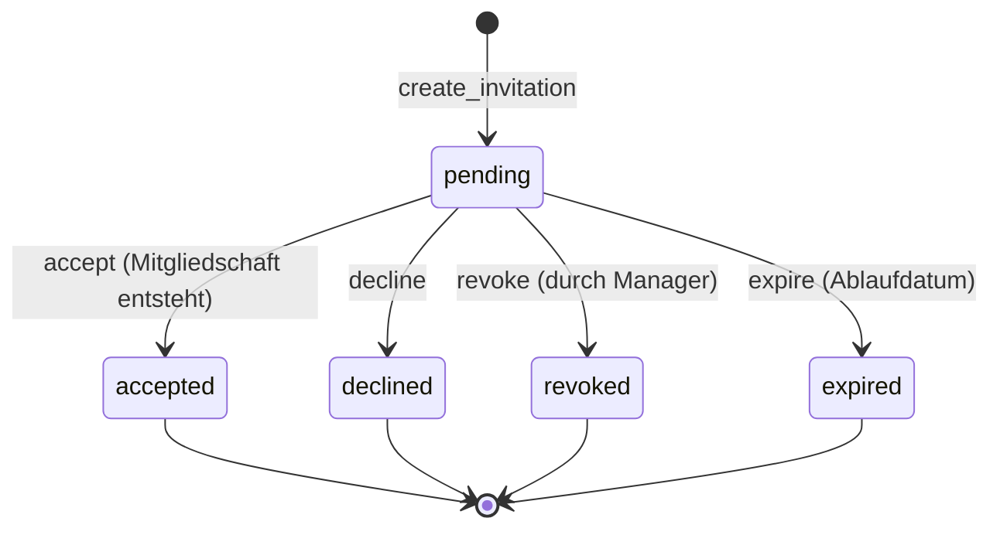
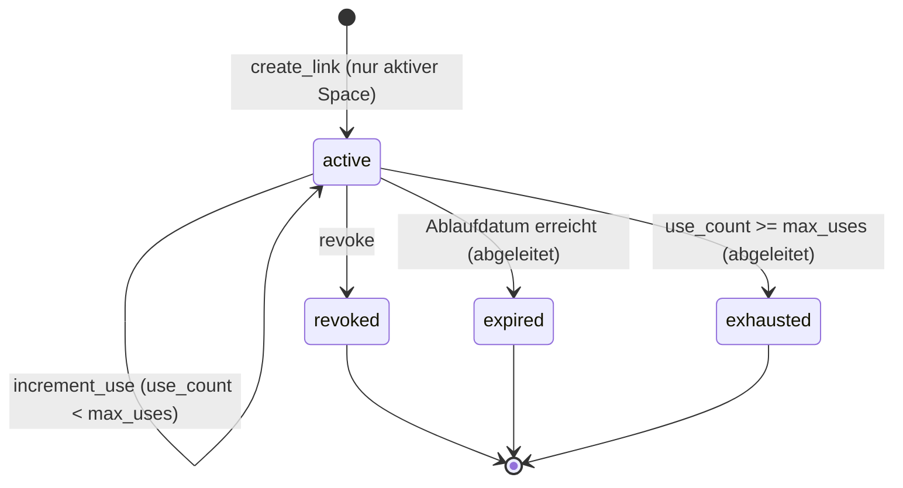
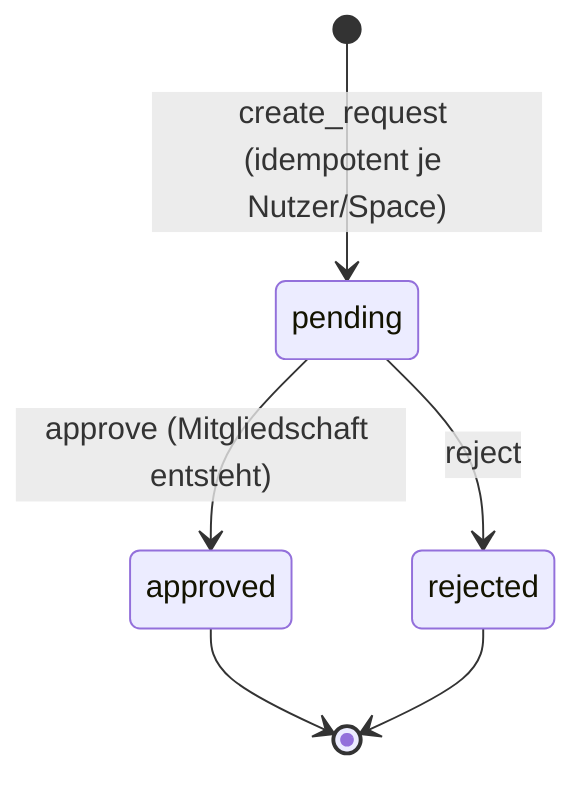

# Domänenmodelle & Zustände

Zustandsmaschinen und Kernattribute der Domain-Objekte. Alle Werte sind Konstanten aus `src/Domain/`.

## Space-Sichtbarkeit

`src/Domain/Space.php`, Feld `visibility` (Default `private`). Erlaubte Werte über `SpaceCreationSettings`:

| Wert | Bedeutung |
| --- | --- |
| `private` | nur Mitglieder sehen und lesen |
| `protected` | sichtbar, aber nur Mitglieder lesen Inhalte |
| `public` | offen lesbar |

Zugriff wird in Asgaros auf Kategorieebene durchgesetzt (siehe [ADAPTER.md](ADAPTER.md)).

## SpaceManager-Rollen

`src/Domain/SpaceManager.php`:

| Konstante | Wert | Rechte |
| --- | --- | --- |
| `ROLE_OWNER` | `owner` | volle Kontrolle inkl. Löschen, Sichtbarkeit, Owner-Transfer |
| `ROLE_MANAGER` | `manager` | Mitglieder, Einladungen, Moderation im Rahmen der Policy |

Schutzregel: Der letzte Owner kann sich nicht selbst entfernen (`SpacePolicy`).

## SpaceLifecycle

`src/Domain/SpaceLifecycle.php`. Reine Klasse ohne WordPress-Abhängigkeit; Übergänge werden zentral über `can_transition()` validiert.

Status: `pending`, `active`, `archived`, `rejected`, `deleted`.

- `is_accessible()` gilt nur für `active`.
- `is_live()` gilt für alles außer `deleted`.
- `pending` bleibt restriktiv: keine Einladungen, keine normale Mitgliederverwaltung, `forum_status = closed`.

## Invitation

`src/Domain/Invitation.php`. Zustände: `pending`, `accepted`, `declined`, `revoked`, `expired`. Operationen: `accept()`, `decline()`, `revoke()`, `expire()`.

Mitgliedschaft entsteht ausschließlich beim Übergang nach `accepted`. Doppelte offene Einladungen werden verhindert/zusammengeführt.

## InviteLink

`src/Domain/InviteLink.php`. Der gespeicherte `status` kennt nur `active` und `revoked`; `expired` und `exhausted` werden dynamisch über `effective_status()` aus Ablauf und Nutzungslimit abgeleitet.

Freigabemodi (`approval_mode`): `auto_join`, `approval_required`, `existing_users_only`.

- Nur der Token-Hash wird gespeichert; Klartext-Token wird einmalig nach Erstellung angezeigt.
- `max_uses = 0` bedeutet unbegrenzt (`has_usage_limit()` = false).
- `revoke()` und `increment_use()` sind nur im effektiven Status `active` erlaubt.

## JoinRequest

`src/Domain/JoinRequest.php`. Zustände: `pending`, `approved`, `rejected`. Operationen: `approve(decider, message)`, `reject(decider, message)`.

Idempotenz: nur eine offene Anfrage pro Nutzer und Arbeitsgruppe. Genehmigung erzeugt echte Asgaros-Mitgliedschaft.

## WorkingGroupMeta

`src/Domain/WorkingGroupMeta.php`. Metadaten oberhalb des technischen Space.

`directory_visibility` (Sichtbarkeit im Verzeichnis, unabhängig vom Zugriff):

| Wert | Bedeutung |
| --- | --- |
| `listed` | im Entdecken sichtbar |
| `members` | nur für Mitglieder sichtbar |
| `hidden` | nicht im Verzeichnis |

`join_policy`:

| Wert | Bedeutung |
| --- | --- |
| `request` | Beitritt anfragbar |
| `invite_only` | nur per Einladung |
| `closed` | kein Beitritt |

Weitere Felder: `join_requests_enabled` (nur wirksam mit `join_policy = request`), `accent_color`, `icon` (siehe [DESIGN-UND-LAYOUT.md](DESIGN-UND-LAYOUT.md)), `contact_text`, `topic_ids`.

> Wichtig: `directory_visibility` (Auffindbarkeit) ist nicht dasselbe wie `Space::visibility` (Zugriff).
